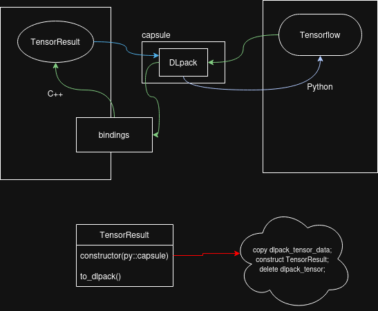

# Proyecto FECUDA (Finding Extremal CUDA Paths)

Este repositorio contiene una implementación de alto rendimiento de un algoritmo **max‑min** (o extremal) que ejecuta cálculos en GPU mediante CUDA y se integra con TensorFlow a través de DLpack. El objetivo es proporcionar una pieza de infraestructura que
- permite operar sobre tensores de TensorFlow sin copiar datos de la GPU,
- encapsula los resultados en objetos Python seguros (`TensorResult`),
- y demuestra un patrón de comunicación entre Python/C++/CUDA útil para acelerar aplicaciones de análisis numérico.

---
## 🧩 ¿Qué hace el proyecto?

- Carga matrices desde NumPy y las convierte en tensores de `tf.float16`.
- Llama a una función `ft.maxmin` implementada en CUDA (vía `forgethreads`), que devuelve rutas y valores extremos.
- Usa DLpack para intercambiar datos cero‑copia entre TensorFlow y la librería C++/CUDA.
- Gestiona la memoria de GPU con sincronización explícita y evita dobles liberaciones gracias a la clase `TensorResult`.

El ejemplo principal se encuentra en `main.py` y se repite varias iteraciones para medir uso de memoria.

---
## 🏗 Arquitectura general

La arquitectura se puede consultar en **`arch.drawio`**; a continuación se resume con palabras:

1. **Python**: punto de entrada (`main.py`).
2. **Bindings C++** (`src/bindings.cu`) construyen un módulo Python usando PyBind11.
3. Dentro del binding hay una estructura `TensorResult` que encapsula:
   - un `py::capsule` apuntando a un tensor DLpack,
   - métodos `to_dlpack()` para devolver ese tensor a TensorFlow.
4. **TensorFlow** interacciona con el binding usando **DLpack** como puente de datos.
5. **CUDA / C++**: la lógica de cálculo de `maxmin` está en `src/algorithms` y `src/kernels`. La ejecución permanece en GPU y devuelve buffers DLpack.

> 🖼️ El diagrama de `arch.drawio` muestra las conexiones entre Python, los bindings C++, el intercambio DLpack y TensorFlow. Echa un vistazo al archivo para ver las flechas y las conversiones de datos.


---
## ⚙️ Ejemplos

El script `main.py` sirve como referencia:

```python
import numpy as np
import forgethreads as ft
import tensorflow as tf
import tensorflow.experimental.dlpack as tf_dlpack

arr = np.load("CC.npy")

tf_a = tf.constant(arr, dtype=tf.float16)
tf_b = tf.constant(arr, dtype=tf.float16)

[paths, values] = ft.maxmin(tf_a, tf_b, 0.4, 1)

paths_tf = tf.experimental.dlpack.from_dlpack(paths)
values_tf = tf.experimental.dlpack.from_dlpack(values)

print("Valores encontrados:", values_tf.shape[0])
```

Simplemente reemplaza `CC.npy` por tus propios datos y ajusta los parámetros según el problema.

---

### Comparación de rendimiento: forgeefects vs forgethreads

Se realizó una comparación de rendimiento entre la implementación en TensorFlow puro (`forgeefects`) y la versión acelerada con CUDA (`forgethreads`).

**Resultados:**

- **forgeefects** (TensorFlow puro): Promedio sobre 10 ejecuciones: 0.012004 s
- **forgethreads** (CUDA): Promedio sobre 10 ejecuciones: 0.000435 s

La versión CUDA muestra una mejora significativa en rendimiento, siendo aproximadamente 27.6 veces más rápida que la implementación en TensorFlow puro.

---

### Comparación de rendimiento: GPU vs CPU reference (por dimensión)

Mediciones sobre el kernel `maxmin_threshold_kernel` en GTX 1650 (sm_75), comparado con una implementación de referencia en CPU (Python/NumPy). Tiempo mínimo de 3 runs; datos float16 aleatorios con semilla fija.

| Config | CPU (ms) | GPU (ms) | Speedup |
|---|---|---|---|
| B=1 M=16 | 2.65 | 6.11 | 0.4× |
| B=1 M=32 | 14.28 | 4.98 | 2.9× |
| B=1 M=64 | 94.29 | 4.07 | **23×** |
| B=1 M=128 | 752.14 | 4.57 | **165×** |
| B=4 M=32 | 51.93 | 3.54 | **15×** |
| B=8 M=32 | 104.43 | 4.25 | **25×** |

Para M ≤ 16 el overhead de transferencia CPU→GPU domina. A partir de M=32 la GPU supera a la CPU con speedup que crece cúbicamente (O(M³) CPU vs O(M²) paralelo en GPU).

El tiempo GPU se mantiene aproximadamente constante (~4–6 ms) independientemente del tamaño porque la ocupancia teórica del kernel es **100%** en sm_75 (22 registros/thread, bloque de 128 threads).

---

## Límites de entrada

### Forma del tensor

| Parámetro | Valor | Motivo |
|---|---|---|
| Forma | `[B, M, N]` con `M == N` | El kernel indexa ambas matrices como `[B, N, N]`; si M ≠ N los índices son incorrectos |
| ndim | ≥ 3 | El constructor `TensorResult` extrae `shape[0]=B, shape[1]=M, shape[2]=N` |
| dtype | `float16` / `bfloat16` | El kernel usa `__half` de CUDA |
| threshold | cualquier float | Para datos en `[0, 1]` el rango útil es `[0.0, 1.0]` |

### Camino COMPLETE vs BATCHED

El umbral interno `MAX_PATHS_PER_ITER = 100,000` determina qué código ejecuta:

- **COMPLETE** (lanzamiento único): `B × M³ < 100,000`
  - Ejemplos: B=1 M≤46 | B=10 M≤21
- **BATCHED** (un lanzamiento por batch): `B × M³ ≥ 100,000`
  - El kernel se lanza B veces sobre slices del tensor

### Límite de memoria GPU (GTX 1650 — 4 GB VRAM)

| M | Entrada (2 tensores float16) | Salida máx BATCHED | Factible |
|---|---|---|---|
| 64 | 16 KB | 4.5 MB | ✓ |
| 128 | 65 KB | 36 MB | ✓ |
| 256 | 262 KB | 288 MB | ✓ |
| 512 | 1 MB | 2.3 GB | ⚠ límite |
| 1024 | 4 MB | 18 GB | ✗ OOM |

**M máximo práctico ≈ 450** para B=1 en GPU con 4 GB.

---

## Validación con compute-sanitizer

Se ejecutaron los cuatro modos del sanitizer sobre el binario compilado con `-lineinfo` (optimizaciones activadas):

| Herramienta | Descripción | Resultado |
|---|---|---|
| `memcheck` | Accesos fuera de límites, memory leaks | **0 errores, 0 bytes leaked** |
| `racecheck` | Data races en shared memory | **0 hazards** |
| `initcheck` | Lecturas de memoria global no inicializada | **0 errores** |
| `synccheck` | Uso incorrecto de `__syncthreads` | **0 errores** |

```bash
# Reproducir:
cd build
compute-sanitizer --tool memcheck  --leak-check=full ./fecuda_main
compute-sanitizer --tool racecheck ./fecuda_main
compute-sanitizer --tool initcheck ./fecuda_main
compute-sanitizer --tool synccheck ./fecuda_main
```

---
##  Demo

1. Construye el proyecto con CMake (`mkdir build && cd build && cmake .. && make`).
2. Genera algunos ficheros NumPy de prueba, por ejemplo `np.random.rand(1000,1000).astype('float16')`.
3. Ejecuta `python3 main.py` y observa cómo se imprime el uso de memoria de GPU y el conteo de valores.


---
## 📁 Estructura relevante

- `src/` – código CUDA/C++.
- `include/` – cabeceras comunes.
- `main.py` – script Python de ejemplo.
- `arch.drawio` – diagrama de arquitectura.
- `requirements.txt` – dependencias Python.

---
## 📝 Licencia y contacto
--